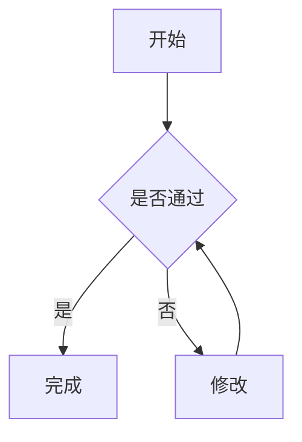
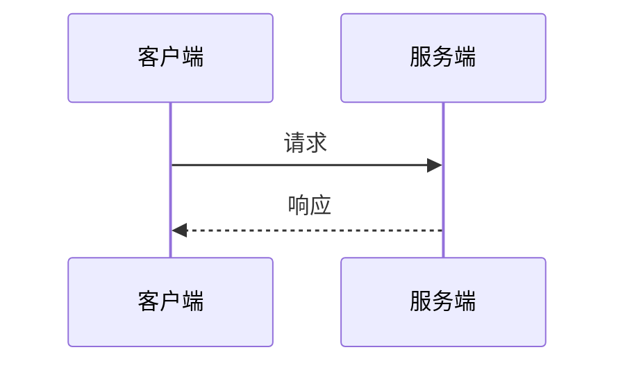
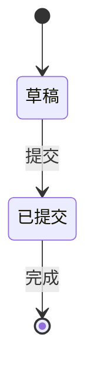
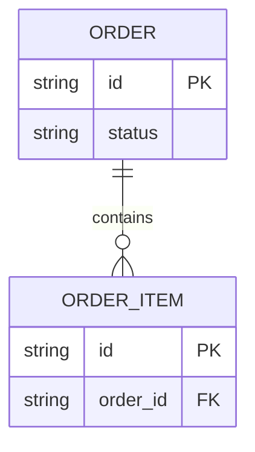
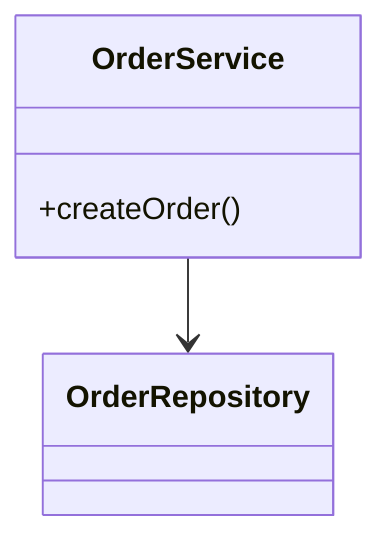
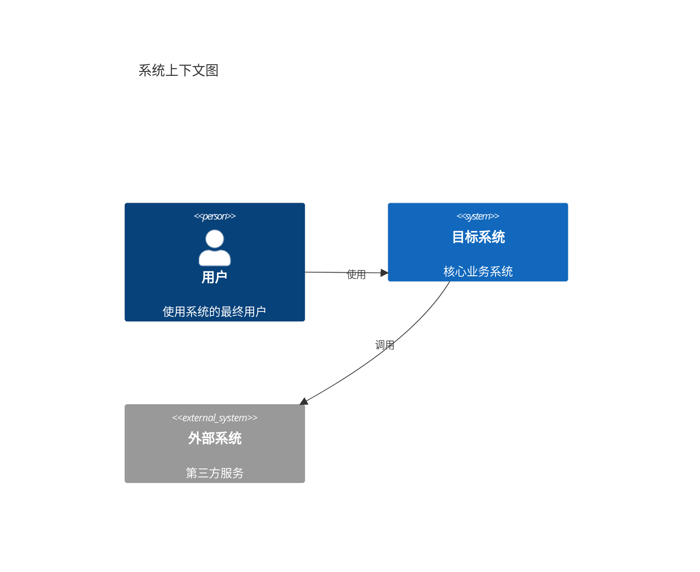
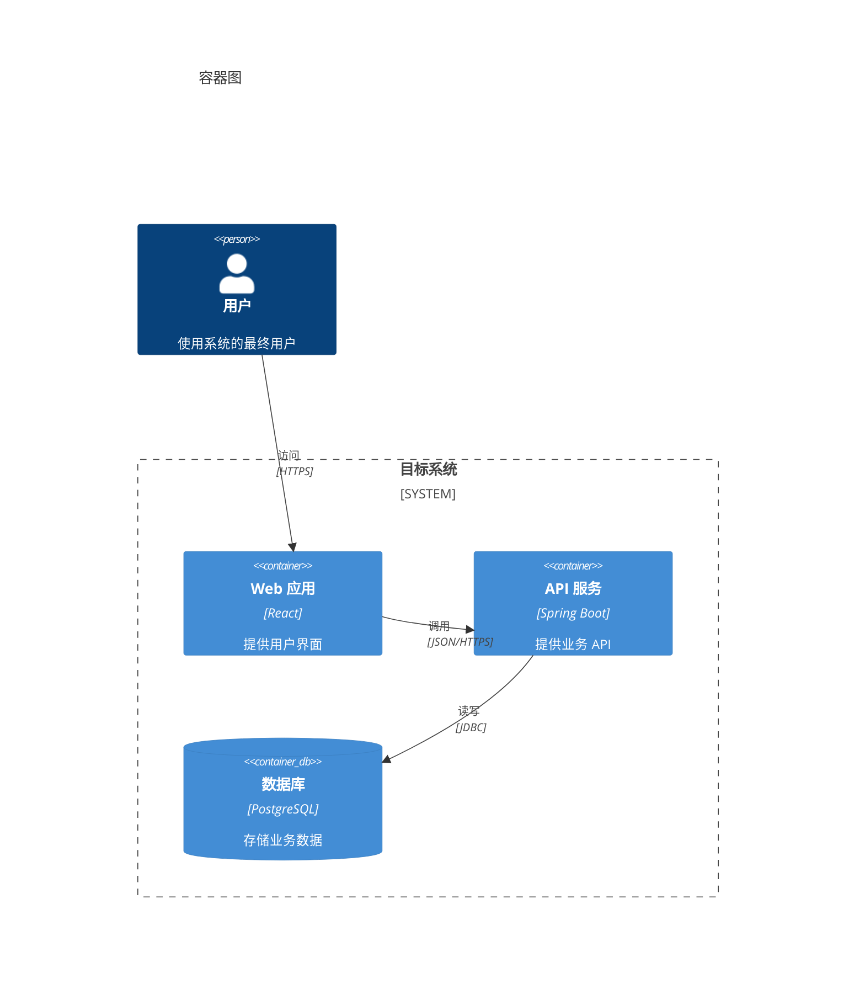
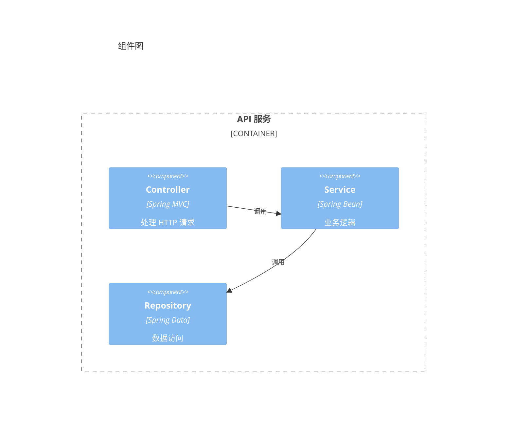
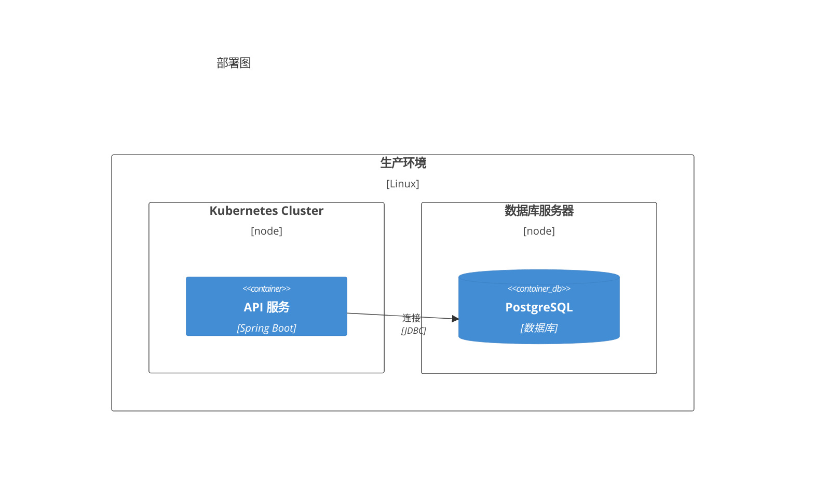
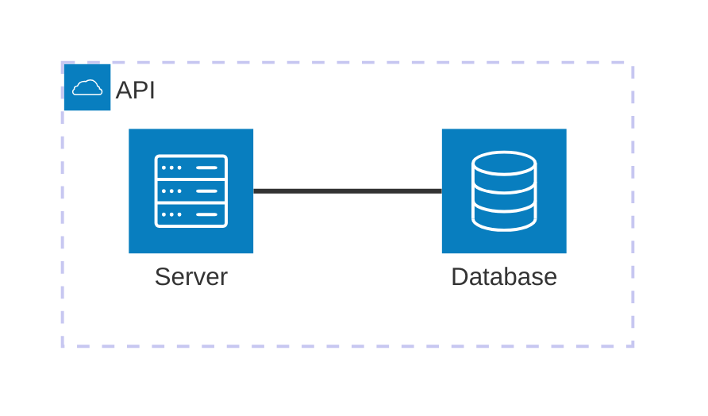

# Mermaid 可移植语法规则

## 适用范围

本文件定义 `common-mermaid-diagram-standards.md` 所要求的语法规则。规则目标是确保 Mermaid 代码在项目目标环境（Kiro Markdown Mermaid Preview + 项目 Mermaid CLI）中可靠解析和渲染，不承诺所有第三方平台视觉完全一致。

## 通用规则

1. 代码块使用 `mermaid` 语言标识，首个有效语句声明图类型。
2. 标识符使用 ASCII 字母开头，仅包含字母、数字和下划线；展示文本与标识符分离。
3. 中文、空格或特殊字符出现在展示文本时使用双引号包裹。
4. 连线、样式和关系只引用标识符，不引用展示文本。
5. Mermaid 注释仅使用 `%%`；不得使用 `#`、`//` 或 Markdown 注释代替。
6. 不使用 Tab；缩进统一使用空格。
7. 避免将小写 `end` 用作 flowchart 节点 ID 或未加引号的标签。
8. 避免会与连线语法组合成特殊边的歧义标识符；连接符后的目标 ID 不以小写 `o` 或 `x` 开头。
9. 标签避免 `数字. 空格` 开头；需要编号时使用 `Step 1:` 或 `1-`。
10. 不依赖分号、省略方向、隐形连线或单行复合连接来压缩代码；以可审阅性优先。

## Flowchart

安全骨架：

规则：

- 使用 `flowchart TD` 或 `flowchart LR`，不混用多个顶层方向。
- 节点先以 ID 和标签明确声明，再用于复杂连接或样式。
- 子图使用 `subgraph group_id["展示名称"]`，结束关键字单独写 `end`。
- 子图内部方向仅作布局提示；存在跨子图连线时不得依赖其一定生效。
- 默认只使用 `-->` 和带文本的 `-->|"标签"|`；虚线或粗线仅在正文定义了明确语义时使用。
- 不使用隐形连线调整布局；布局不理想时拆图或简化关系。
- 默认不使用 HTML 标签、click、动画或外部资源。
- Mermaid frontmatter 和初始化 directive 可在目标 Mermaid 版本支持时使用。

## Sequence Diagram

安全骨架：

规则：

- participant 标识符使用 ASCII；中文只放在 `as` 后的展示名和消息文本中。
- 消息必须明确方向；同步、异步和返回箭头的语义在同一文档中保持一致。
- 不使用脚本回调、外部链接或依赖特定主题的样式。

## State Diagram

安全骨架：

规则：

- 状态标识符使用 ASCII，并通过 `state "展示名" as StateId` 定义中文名称。
- 所有迁移必须有明确来源和目标；业务动作需要时写在冒号后。
- 起点和终点使用 `[*]`，不得用不存在的虚构状态补齐流程。

## ER Diagram

安全骨架：

规则：

- 实体名和字段名使用稳定 ASCII 标识符；业务中文名称在相邻表格中说明。
- 关系基数必须来自需求或数据模型证据，不得为图形完整性猜测。
- 字段只保留理解关系所需的关键项；完整字段和约束留在正文表格。

## Class Diagram

安全骨架：

规则：

- 类和成员标识使用代码或设计中的真实名称。
- 只表达已确认的继承、实现、组合或依赖，不从目录结构猜测关系。
- 复杂签名、泛型和注解放入正文，避免解析器版本差异。

## C4 Diagram

C4 图类型（C4Context、C4Container、C4Component、C4Dynamic、C4Deployment）在目标环境验证可用后允许使用。语法兼容 C4-PlantUML。

### C4Context 安全骨架

### C4Container 安全骨架

### C4Component 安全骨架

### C4Deployment 安全骨架

### C4 规则

- 图类型声明使用 `C4Context`、`C4Container`、`C4Component`、`C4Dynamic` 或 `C4Deployment`，独占首行。
- 使用 `title` 声明图标题。
- Person/System/Container/Component 等元素的第一个参数为 alias（ASCII 标识符），后续参数为展示信息。
- 中文展示文本使用双引号包裹。
- 边界使用 `System_Boundary`、`Container_Boundary`、`Enterprise_Boundary` 或 `Deployment_Node`，以花括号包裹内部元素。
- 关系使用 `Rel(from, to, label)` 或 `Rel(from, to, label, techn)` 格式。
- 布局不使用 `Lay_*` 系列语句（Mermaid 不支持）；通过语句顺序调整位置。
- 可使用 `UpdateLayoutConfig` 调整每行节点数和边界数。
- 可使用 `UpdateRelStyle` 和 `UpdateElementStyle` 微调样式。
- 不使用 sprite、tags、link 等 Mermaid 尚未支持的 C4-PlantUML 特性。

## Architecture Diagram (architecture-beta)

`architecture-beta` 在目标环境验证可用后允许使用。适用于云服务/CI-CD/基础设施资源关系。

### architecture-beta 安全骨架

### architecture-beta 规则

- 图类型声明使用 `architecture-beta`，独占首行。
- 使用 `group` 定义分组，`service` 定义服务节点，`junction` 定义连接分叉点。
- 图标使用内置图标（cloud、database、disk、internet、server）；使用其他 Iconify 图标需确认项目已注册对应 icon pack。
- 标签使用方括号 `[Label]` 包裹，图标使用圆括号 `(icon)` 包裹。
- 边的方向使用 `:{T|B|L|R}` 指定出入端口。
- 箭头使用 `<` 和 `>` 表示方向：`-->` 单向，`<-->` 双向，`--` 无方向。
- group 内可嵌套 group，service 通过 `in group_id` 指定归属。
- 不要将关系连接到 group 本身；使用 `{group}` 修饰符从 group 边缘出入。
- 可使用 `%%{init: {"architecture": {...}}}%%` frontmatter 配置布局参数。

## 静态检查清单

写入前至少检查：

- [ ] 代码围栏闭合且语言为 `mermaid`；
- [ ] 图类型和方向已显式声明；
- [ ] ID 唯一并符合 ASCII 命名规则；
- [ ] 展示标签中的中文、空格和特殊字符已安全包裹；
- [ ] 连线只引用 ID（flowchart）或 alias（C4）；
- [ ] 子图/边界具有稳定 ID 且闭合配对（`end` 或 `}`）；
- [ ] 注释使用 `%%`，无 `#` 伪注释；
- [ ] 无小写 `end` 歧义、`数字. 空格` 标签或连接符后的 `o/x` 歧义；
- [ ] 无默认禁止的交互或外部资源特性；
- [ ] 图表语义与相邻正文一致，未引入未批准内容；
- [ ] C4/architecture-beta 图类型未使用目标 Mermaid 版本不支持的特性。

静态检查不能替代 Mermaid parser。无法执行 Mermaid CLI 验证时，必须明确记录"未执行真实语法解析"。

## 技术依据

- Mermaid 官方 Diagram Syntax 与各图类型文档（含 C4 和 Architecture Diagrams）；
- Mermaid C4 语法兼容 C4-PlantUML 的已支持子集；
- `axton-obsidian-visual-skills`（MIT）仅作为常见错误与可读性参考，未直接采用其相互冲突或平台专属规则。
