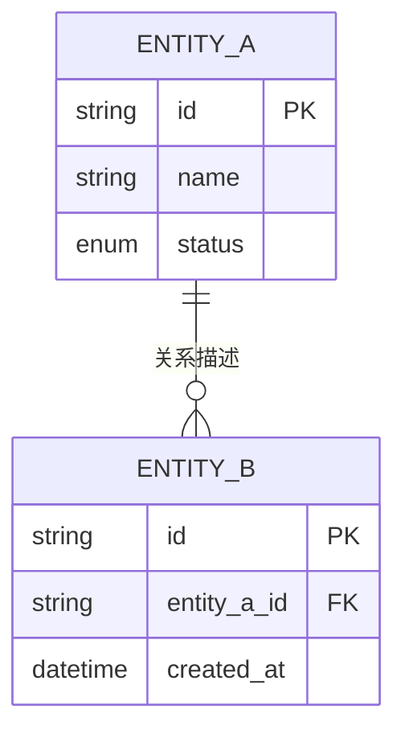
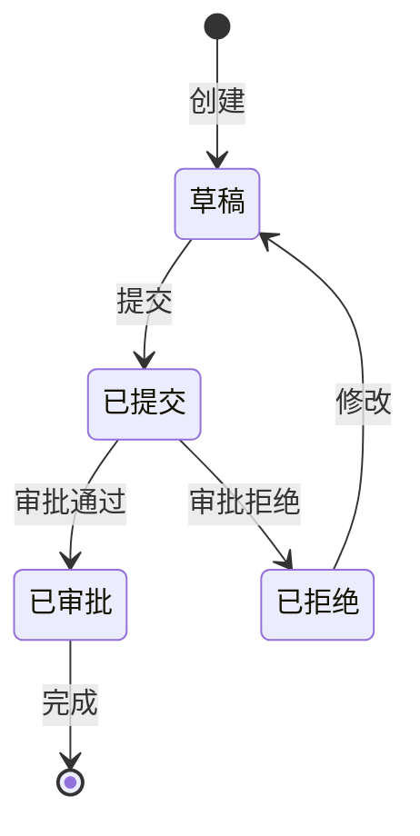

# 需求阶段状态流转与数据建模

**加载条件**：所有深度执行状态流转适用性判定；仅全面深度执行完整实体、字段和 ER 建模。

**目的**：业务涉及生命周期时不因深度较低而遗漏状态约束；全面深度再建立完整数据模型。

---

## 实体识别

从需求中提取所有数据实体：

```markdown
## 数据实体清单

| 实体 | 描述 | 关键属性 | 来源需求 |
|------|------|----------|----------|
| [实体名] | [一句话描述] | [核心字段] | REQ-XXX |
```

---

## 实体关系图（ER Diagram）

使用 Mermaid erDiagram 语法：



**关系类型**：

| 符号 | 含义 |
|------|------|
| `\|\|--o{` | 一对多 |
| `\|\|--\|\|` | 一对一 |
| `}o--o{` | 多对多 |
| `\|\|--o\|` | 一对零或一 |

---

## 状态流转判定（所有深度）

出现以下任一信号时必须执行状态建模：

1. 业务对象存在生命周期；
2. FR 出现启用、停用、暂停、恢复等语义；
3. FR 出现审核或审批语义；
4. FR 出现生效时间语义；
5. FR 出现“状态”“阶段”“节点”且取值可枚举；
6. 存量项目被改造对象已有状态机。

无论是否触发，都必须在 `requirements.md` 记录结论和依据。未触发时明确写“不涉及状态流转”，不得静默跳过。触发时将状态模型写入 `data-model.md`。

## 状态图（条件强制）

使用 Mermaid `stateDiagram-v2`：



**状态图约束**：
- `[*]` 明确起始和终止节点，所有终态必须可识别；
- 每条迁移必须包含触发事件和业务前置条件，无前置条件时显式写“无”；
- 每个状态、枚举和迁移关联至少一个 FR；
- 存量项目已有状态机时，在图后提供“新需求状态 ↔ 基座既有状态”对照表并列出冲突；

---

## 执行步骤

1. 所有深度先执行状态流转触发判定并记录依据；
2. 触发时为相关对象绘制状态图并建立基座对照（存量项目）；
3. 全面深度识别实体、字段并绘制 ER 图；
4. 向用户确认适用的数据与状态模型。
5. 向用户确认适用的数据与状态模型。

**产出**：触发状态建模或执行全面数据建模时写入 `docs/aidlc/inception/requirements/data-model.md`；未触发且非全面深度时不创建空文件。

---

## 数据模型检查清单

- [ ] 所有需求中提到的实体都已识别
- [ ] 主键已定义
- [ ] 外键和关系已映射
- [ ] 关键属性类型已指定
- [ ] 状态流转触发结论及依据已写入 requirements.md
- [ ] 命中任一触发信号时有状态图，且迁移含事件、前置条件和终态
- [ ] 存量状态机有新旧对照及冲突清单
- [ ] 适用的数据与状态模型已由用户确认
