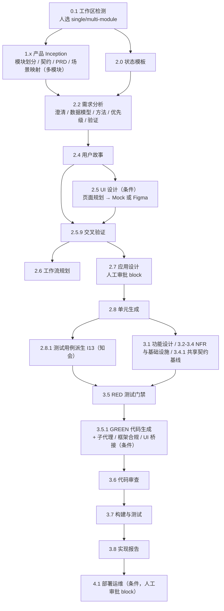

# 在 AI 工具中使用 AI-DLC 实施项目指南

本文说明如何在 Kiro（IDE / CLI / Crew）、Claude Code、Codex、OpenCode、CodeBuddy、Qoder、ZCode 及 Multica 中，用 `loeyae-aidlc` 驱动项目从需求到交付的全过程。覆盖四类场景：

| 场景 | 典型诉求 | 本文章节 |
| --- | --- | --- |
| 正序实施（新项目 / 新功能） | 从零做一个系统或一个完整功能 | §4 |
| 已有项目定制开发 | 在存量代码上加功能、改造模块 | §5 |
| 缺陷修复 / 无行为重构 | 修 bug、整理代码但不改变行为 | §6 |
| 变更请求（CR） | 已交付的行为、契约或验收标准要改 | §7 |

命令细节见 `docs/loeyae-aidlc-cli-guide.md`，安装与升级见 `docs/loeyae-aidlc-v2-installation.md`，触发关键词见 `docs/ai-dlc-keyword-guide.md`。本文只讲“怎么串起来用”。

## 1. 先理解的五条规则

1. **引擎决定流程，Agent 执行阶段。** 阶段顺序、依赖、条件和门禁全部在阶段图中，Agent 每次只通过 `orchestrate next` 拿到一个 directive，完成后用 `orchestrate report` 上报。不要让 AI “凭经验”跳步或并步。
2. **控制面只有两个文件**：`aidlc/active/aidlc-state.md` 与 `aidlc/active/audit.md`（拆分模块后另有 `modules/<id>/`、`integration/` 和 `registry.md`）。它们由引擎维护，禁止手改。
3. **证据不能手写。** `.aidlc/evidence/**` 下的 JSON 由受控 producer 生成并带防伪印章，`report` 会自动生成缺失证据。AI 手写证据会被判为伪造。
4. **`handoff_prompt` 必须原样展示。** 它是下一步的权威提示，换会话、换人、换工具都靠它续接。
5. **人做决策，AI 不代批。** `workspace-detection` 的单/多模块选择、`application-design` 与 `operations` 的审批、CR 的风险确认、最终 merge/push，都必须由人明确回答。

## 2. 准备

### 2.1 安装

```bash
npm install -g https://github.com/loeyae/loeyae-aidlc-v2/archive/refs/heads/main.tar.gz
loeyae-aidlc install --all                 # 安装到所有检测到的工具
loeyae-aidlc install --harness kiro-ide    # 或只装某一个
loeyae-aidlc install --list                # 自检：列出可用 harness 及安装位置
loeyae-aidlc version                       # 自检：确认 CLI 版本

# Kiro IDE / Kiro CLI 的 Stop Hook 是项目级资产，需对每个业务项目单独安装
loeyae-aidlc install --harness kiro-ide --project /absolute/path/to/project
```

`--project` 只支持 `kiro-ide`、`kiro-cli`、`codebuddy`、`qoder`，且不能与 `--all` 同时使用；Kiro 的 Hook 写入 `<项目>/.kiro/hooks/loeyae-aidlc.json`。`--project` 路径不存在时，全局 Skill 会先装好再报错退出，只缺项目 Hook，修正路径后重跑即可（见安装文档）。`runtime doctor` 需要已有活动 workflow，应在 §4.2 启动之后再用于诊断。

升级时先 `loeyae-aidlc uninstall --all`、`npm uninstall -g loeyae-aidlc`，再重新安装并重启工具。

### 2.2 项目侧配置（按需）

| 文件 | 何时需要 | 作用 |
| --- | --- | --- |
| `.aidlc/source-roots.json` | 源码不在 `src/`（如 Python 的 `app/`、前端 `web/src`），或业务代码在嵌套独立 git 仓库 | 告诉 sensor 去哪里扫源码；嵌套仓库写 `{ "path": "app", "repo": "nested" }` |
| `.aidlc/commands/<stage>.json` 或 `.aidlc/evidence-commands.json` | 进入 `tdd` / `code-generation` / `build-and-test` 之前 | 声明真实的 RED / BASELINE / GREEN、构建、测试、检查命令（`stage` 字段必须与阶段一致） |
| module-manifest 的 `paths` | 多模块且模块有独占代码目录 | 让模块证据只受本模块代码影响 |

`.aidlc/commands/tdd.json` 示例（有新行为 UC-D 时恰好一条 `role: red`，有存量行为 UC-D 时恰好一条 `role: baseline`）：

```json
{
  "version": "1",
  "stage": "tdd",
  "commands": [
    { "id": "red", "role": "red", "argv": ["npm", "test", "--", "tests/order-export"] }
  ]
}
```

`evidence run --help` 只输出命令用法，不含配置字段说明；字段以 README“源码根与命令清单”一节和引擎报错提示为准。

## 3. 在各 AI 工具中如何驱动

所有工具的底层动作一致：AI 在项目根目录执行 `loeyae-aidlc orchestrate next/report`，读取 directive 中的阶段文件、`consumes` / `produces` / `sensors`，完成产物后上报。差别只在“怎么唤起”和“谁当协调者”。

| 工具 | 安装后得到 | 推荐用法 |
| --- | --- | --- |
| Kiro IDE | 全局 Skill + MCP；Stop Hook 需按 §2.1 用 `--project` 安装到项目（安装后 workflow 运行中会提示继续或明确暂停） | 在 Chat 中直接说“使用 AI-DLC，……”；一个 Chat 会话当协调者 |
| Kiro CLI | 与 Kiro IDE 共享同一个全局 Skill + MCP；Stop Hook 同样需 `--project` 安装 | `kiro-cli chat` 中同样用自然语言触发；适合长流程与脚本化 |
| Kiro Crew | Skill + MCP 配置 | 主会话当 conductor；directive 的 `agent_execution` 为 `delegate` / `review` / `mob` 时可派发子 agent |
| Claude Code | `CLAUDE.md` 指令、`/aidlc-approve` 命令、hooks | 自然语言触发；审批阶段可用 `/aidlc-approve` |
| Codex / OpenCode / CodeBuddy / Qoder / ZCode | Skill 或插件 + hooks | 自然语言触发，命令执行方式与上面相同 |
| Multica | `aidlc-multica-orchestration` Skill | 父议题的协调者推进 AI-DLC，子议题只交付产物（见 §8） |

### 3.1 通用提示词

| 目的 | 提示词 |
| --- | --- |
| 开始新工作 | `使用 AI-DLC，scope 用 feature，工作：<一句话目标 + 范围 + 约束>` |
| 继续 | `使用 AI-DLC，继续上次的工作` |
| 只看状态 | `AI-DLC 当前进度和阻塞是什么`（对应 `runtime summary` / `next --status`） |
| 审批 | `确认应用设计，Approve`（必须是人说） |
| 暂停 / 恢复 | `暂停 AI-DLC` / `恢复 AI-DLC` |
| 发起变更 | `使用 AI-DLC 发起变更请求：<当前行为> 改为 <期望行为>，原因 <…>` |

工作描述越具体，下游需求、故事和测试越不容易偏。建议包含：业务目标、涉及模块、明确不做的内容、技术约束、验收方式。

### 3.2 协调者与子 agent 的边界

directive 可能带 `agent_execution`（`inline` / `delegate` / `pipeline` / `mob` / `review`）。无论哪种模式，**只有协调者（conductor）**可以执行 `orchestrate report`、更新 state/audit、接受审批、merge 或 push。子 agent 只返回结构化结果，协调者用 `loeyae-aidlc agent validate-result <result.json>` 校验后再上报。工具不支持子 agent 时，协调者明确回退 inline 执行。

## 4. 流程 A：正序实施（新项目 / 新功能）

### 4.1 选择 scope

阶段图共 46 个阶段。引擎的筛选规则是：`execution: ALWAYS` 的阶段对所有 scope 生效，其余阶段只在其 `scopes` 列出该 scope 时生效；`prd-generation` 是用户选择阶段，只在完整 scope 初始化时加 `--with-prd` 才进入。下表的阶段数是在空 git 仓库中执行 `orchestrate next --scope <scope>` 后由 `next --status` 实测得到的（loeyae-aidlc 4.13.0，单模块默认路由）。单模块下每个阶段对应一个实例，阶段数等于实例数；选择 multi-module 后，module 轴阶段按模块数、unit 轴阶段按各模块的单元数展开，实例数会多于阶段数：

| scope | 阶段数（单模块下等于实例数） | 阶段集合 | 适用 |
| --- | --- | --- | --- |
| `feature` / `enterprise` / `mvp` | 45 | 完整 Inception → Construction → `operations`、`operations-templates`（条件） | 常规功能、新系统、需要部署准备的交付；三者阶段集合相同，差别只在 AI 按复杂度选择的文档深度 |
| `classic` | 43 | 同上，但不含 `operations` 与 `operations-templates` | 不需要部署准备 |
| `express` / `workshop` / `bugfix` / `refactor` / `poc` | 8 | `workspace-detection` → `state-template` → `test-case-derivation` → `tdd` → `code-generation` → `code-review` → `build-and-test` → `implementation-report` | 小改动、演示培训、缺陷修复（§6）、无行为重构（§6）、概念验证 |

8 阶段 scope 的共同点：

- 没有需求、故事、设计和单元生成阶段，工作描述本身就是需求输入，所以 `--work` 要写清行为与验收方式；
- `workspace-detection` 不提供 `single-module` / `multi-module` 选择（只有 feature、enterprise、mvp、classic 才有），按 instruction-only 直接上报；
- 只有一个模块 `project` 和一个单元 `default`，不能拆分并行；
- 不支持 `--with-prd`。

`poc` 在阶段图中没有任何阶段把它列入 `scopes`，它只获得 8 个 ALWAYS 阶段，因此与 express 的路由完全一致，**并不比 express 更宽松**：同样要求 I13 用例、RED 受控失败、GREEN 通过、审查和真实构建测试。引擎中针对单个 scope 的额外规则只有 `bugfix`（见 §6），`poc` 没有。

复杂度只决定文档深度和条件阶段是否执行，**不削弱** TDD（RED→GREEN）、两轴审查、真实构建测试和证据要求。用户说“快一点”不能跳过这些门禁，只能缩小交付范围。工作途中发现需要需求、设计或多模块时，8 阶段 scope 无法“升级”出这些阶段，应 `park` + `archive` 后用完整 scope 重新开始。

### 4.2 启动

```bash
loeyae-aidlc orchestrate next --scope feature --work "实现订单导出：支持按条件导出 CSV，超时自动重试 3 次"
```

已有未归档 workflow 时引擎会拒绝创建，并提示先 `park` 再 `archive`，或不带参数继续。需要 PRD 时在初始化时加 `--with-prd`（仅完整 scope，之后不能再补选）。

### 4.3 阶段总览

阶段按轴分为 project（全局）、module（模块）、unit（工作单元）。条件不满足的阶段由引擎记为 `condition_skipped`，无需手动跳过。



### 4.4 各段要点

**工作区检测（0.1）**：AI 识别技术栈、构建与测试入口、模块边界；完整 scope 下向人展示 `single-module` / `multi-module`，等待回答后上报：

```bash
loeyae-aidlc orchestrate report --stage workspace-detection --result completed \
  --instruction-ack workspace-detection --user-input multi-module
```

**产品 Inception（1.x，多模块时）**：产出模块划分、跨模块契约（`product-contracts.md`）、PRD 与场景映射。跨模块依赖以契约文件为唯一来源，后续用于模块准入和集成屏障。

**需求与故事（2.2–2.4）**：

- 需求条目使用 `REQ-xxx` 并带 `track:[backend/frontend/data/infra/nfr/doc-only]` 标签，这是追溯矩阵的起点。
- 需求澄清每轮只问一个问题、附推荐答案，结论登记为 `CL-xxx`；确实无需澄清时显式写“无澄清项”。
- 优先级由人裁定后上报。

**UI 设计（2.5，条件）**：有界面需求时先做页面规划，再走 HTML Mock 或 Figma 之一；交叉验证（2.5.9）对账需求、故事与 UI，发现冲突由人裁决（见 §7.1）。

**应用设计（2.7）**：组件、接口、方法签名与依赖图（默认 Mermaid）。这是 `block` 审批点，AI 展示设计与影响后等待人明确批准：

```bash
loeyae-aidlc orchestrate report --stage application-design --result approved --user-input Approve
```

**单元生成（2.8）**：生成 `unit-manifest.json`。之后团队成员认领（§8）。

**测试用例派生 I13（2.8.1，module 轴）**：引擎在单元生成之后、按单元设计之前路由到本阶段（`next --status` 实测顺序为 `units-generation → test-case-derivation → functional-design`）。为每个可执行行为生成 UC-D，带 `tdd_mode`：

- `new`（默认）：新行为，走 RED → GREEN；
- `characterization`：存量行为，须声明 `code_refs`、`reason`、`approval_ref`，走 BASELINE → GREEN（见 §5）。

多单元模块在 UC-D frontmatter 写 `unit_refs: [<unit-id>]`，要么全部声明要么全部不声明。

**按单元设计（3.1–3.4.1）**：功能设计、NFR、基础设施、共享契约基线按条件执行。共享契约的消费者在消费者状态表标为 `verified` 后，消费方才能解除阻塞。

**RED 与 GREEN（3.5 / 3.5.1）**：先运行 `role: red` 命令得到受控失败证据，再实现代码，`role: green` 命令须覆盖本单元全部 UC-D。禁止先写生产代码后补测试，禁止用文字声明代替 RED/GREEN 证据。

**代码审查（3.6）**：Spec（是否符合需求/设计）与 Standards（代码规范）两轴审查，`mode: review` 时审查者独立、只读；review 证据的 `files_reviewed` 必须覆盖实际变更路径。

**构建与测试（3.7）**：运行声明的真实命令；多模块时还要对账每个 UC-D 都出现在其 `unit_refs` 对应单元的 GREEN 中，以及所有共享契约已 verified。

**实现报告（3.8）与部署运维（4.1，条件）**：部署决策同样是 `block` 审批。引擎不覆盖部署后的生产运营。

### 4.5 多模块并行

`module-division` 完成后可拆分为按模块独立的 workflow，避免一个模块被门禁卡住拖住全部：

```bash
loeyae-aidlc orchestrate split --from <workflow-id> --dry-run   # 先预览
loeyae-aidlc orchestrate split --from <workflow-id>
loeyae-aidlc orchestrate next --module order-export              # 只推进该模块
loeyae-aidlc orchestrate report --stage <slug> --module order-export [--unit <unit-id>] --result completed
loeyae-aidlc orchestrate next --status                           # 全局概览与集成屏障
```

集成阶段（build-and-test 起的尾部 project 阶段）只有在所有模块 construction 完成、所有共享契约 verified 后才会放行。

### 4.6 收尾

1. 每个单元在自己的分支/worktree 完成后生成 merge plan，由有权限的人执行 merge：

   ```bash
   loeyae-aidlc worktree merge-plan --instance <stage-instance> --member <name> \
     --path <absolute-worktree-path> --review-evidence <review.json>
   ```

2. workflow 完成后归档，为下一项工作腾出控制面：

   ```bash
   loeyae-aidlc orchestrate archive --reason "订单导出 v1 交付完成"
   ```

## 5. 流程 B：已有项目上定制开发

与正序实施的阶段相同，差别在于必须先“看清并锁定现状”，再改。

### 5.1 步骤

1. **配置源码根**：源码不在 `src/` 或有嵌套仓库时，先写 `.aidlc/source-roots.json`（§2.2）。嵌套仓库的约束：必须是仓库根、无符号链接/junction、互不包含、外层仓库不跟踪其中文件。
2. **启动**：`orchestrate next --scope feature --work "<在现有系统上要做的事>"`。工作描述里写清“改哪个模块、不能影响什么”。
3. **工作区检测**：AI 必须基于实际文件记录现状（技术栈、构建、测试入口），不得根据文件名推断。
4. **逆向工程（2.1，`has_legacy_code` 自动触发）**：生成现有架构、业务事务、依赖与基础设施的设计产物。产物已存在且代码无重大变化时，AI 会询问是否跳过。
5. **确认基线**：存量行为的 BASELINE 依赖工作流基线。新 workflow 在 `next --scope` 初始化时会自动把当前 HEAD 记为基线（输出 `Baseline commit: <sha> (created)`），声明了嵌套仓库时同时记录各子仓库 HEAD，无需再登记。因此启动前应先提交或清理工作区，让 HEAD 就是定开起点；启动后用下面的命令确认：

   ```bash
   loeyae-aidlc orchestrate baseline
   ```

   只有 4.6 之前创建、没有基线的 workflow 才需要补登：

   ```bash
   loeyae-aidlc orchestrate baseline --set <commit> --user-input Approve --reason "补登定开起点"
   # 有嵌套仓库时补 --repo app=<sha>
   ```

   补登或 `--replace` 更正的 commit 必须早于 workflow 启动时间，否则引擎拒绝（`the baseline must predate the workflow`）；启动后的提交只能用 §5.2 的 `--advance` 推进。

6. **需求与设计**：新增需求照常编号；涉及存量行为改变时，需求中要写明“当前行为 → 期望行为”。
7. **I13 区分新旧行为**：
   - 新增行为：`tdd_mode: new`，RED → GREEN；
   - 必须保持不变、但本次会触碰的存量行为：`tdd_mode: characterization`，声明 `code_refs`、`reason`、`approval_ref`，在修改任何 code ref 之前运行 BASELINE（命令须退出 0，且 code ref 与基线 blob 一致）。
   - 不再存在“重构可豁免 TDD”的豁免。
8. **Construction 与交付**：同 §4.4–4.6。workflow 有基线后（新 workflow 初始化即有），`no-todo`、`traceability` 等文件级 sensor 只看本单元相对基线的变更文件，不会被存量代码的历史问题卡住；交付文件中至少要有一处引用本单元的 `REQ`。

### 5.2 多单元依次修改同一批代码

上一个单元的 `code-generation` 完成并提交后，推进基线再继续下一个单元：

```bash
loeyae-aidlc orchestrate baseline --advance <上一单元 GREEN 证据的 source_revision.commit> \
  --expect <当前基线> --user-input Approve --reason "unit-a 已交付"
```

不能在某个单元的 BASELINE 与 GREEN 之间推进；不带参数的 `orchestrate baseline` 可查看当前代与完整链。

### 5.3 存量产物迁移与接管

| 情况 | 处理 |
| --- | --- |
| 旧项目 `requirements.md` 没有 `REQ-xxx` 或缺 `track` | 引擎记 `MIGRATION_REQUIRED` 降级放行并给出缺失清单；可用 `scripts/legacy-id-migrate.ts` 统一前缀，再人工补 `track` 与 AC（参见 `docs/optimization-notes/legacy-migration-plan.md`） |
| 模块已按旧流程提交了实现，之后才交给门禁接管 | split 布局下用 `orchestrate baseline --adopt <commit> --module <id> --user-input Approve --approval-ref "<批准记录>" --reason "<原因>"` 登记接管基线 |
| 合并后出现另一条未退役 lineage | `orchestrate state verify` 检查；由负责人 `state retire` 或 `state adopt --module` 裁决。合并冲突时禁止对 `aidlc/active/` 整目录“保留本地” |

## 6. 流程 C：缺陷修复与无行为重构

两者都针对“已有代码基线”的范围，且不改变已批准的行为语义，因此**不走 CR**，也不经过需求与设计阶段。

```bash
loeyae-aidlc orchestrate next --scope bugfix   --work "订单导出超过 1 万行时超时，期望 30 秒内完成（REQ-012 原有验收）"
loeyae-aidlc orchestrate next --scope refactor --work "拆分 OrderExportService，外部行为与接口不变"
```

路由（实测，与 express 相同的 8 个阶段）：工作区检测（无单/多模块选择）→ 状态模板 → 测试用例派生 → RED → GREEN → 代码审查 → 构建测试 → 实现报告。没有需求和设计阶段，工作描述中应写明对应的已批准需求或验收标准。

| scope | 关键约束 |
| --- | --- |
| `bugfix` | 至少一个 `tdd_mode: new` 的 UC-D 复现缺陷（RED 必须真实失败），全部是 characterization 会被拒绝 |
| `refactor` | 被触碰的行为用 characterization UC-D 锁定（基线在初始化时自动记录，启动前应确保工作区干净），GREEN 证明行为不变 |

判断边界：修复后行为回到已批准的需求/故事/契约 = 缺陷；修复“顺便”改了验收标准或接口语义 = 需求变更，必须转 CR。

## 7. 流程 D：变更请求（CR）

完整规则见 `core/knowledge/protocols/change-request-process.md`。核心原则：CR 是暂态差异，正式基线就地更新，Git 历史是唯一长期档案。

### 7.1 先分流

| 类型 | 判定 | 去向 |
| --- | --- | --- |
| 在途产品协调 | 受影响范围**尚无代码基线**，需求/故事/UI/设计有语义差异 | 不建 CR；由人裁决“以需求/故事/UI 为准或重新定义”，就地更新并从最早受影响阶段重做 |
| 缺陷修复 | 已有基线，实现不满足已批准内容 | §6 |
| 无行为重构 | 已有基线，不改外部可观察行为 | §6 |
| 需求/契约语义变更 | 任一受影响范围已有代码基线，且改变行为、验收标准、接口契约、数据语义或交付方式 | CR1–CR5 |

“代码基线”指存量系统已实现的行为，或已有实际构建测试通过证据的范围；只写了代码不算。多范围混合时按最高成熟度处理，不得拆小请求绕过 CR。

### 7.2 CR 生命周期

```text
CR1 定位 → CR2 影响评估（人确认风险级别） → CR3 计划 → CR4 执行 + 就地更新基线 → CR5 合并门禁 → 删除暂态 → 完成
```

| 步骤 | AI 做什么 | 人做什么 |
| --- | --- | --- |
| CR1 | 定位需求、故事、UC-D、设计、单元、代码、配置与证据，输出当前行为 / 期望行为 / 直接修改范围 | 确认目标与待确认项 |
| CR2 | 沿“需求 → 故事与用例 → 设计 → 单元 → 契约/配置/数据 → 运行时消费者 → 代码与部署 → 验证”评估，给出 L1–L5 | 确认风险级别、修改/验证/观察范围 |
| CR3 | 按依赖与部署顺序列计划；L3+ 可建暂态摘要 `docs/aidlc/change-requests/CR-<id>.md` | 确认计划 |
| CR4 | 修改代码，**直接**更新 PRD（Patch 模式）、需求、故事、设计、契约、测试用例、单元定义 | L4–L5 审批迁移与回滚 |
| CR5 | 一致性验证 + 合并门禁清单 | 执行 merge |

风险分级：

| 级别 | 判定 | 最低处理 |
| --- | --- | --- |
| L1 | 单文件/单组件，不改外部行为 | 定向实现与验证，不建 CR 文件 |
| L2 | 单服务行为变化，无跨边界影响 | 精简 CR，服务级回归，不建 CR 文件 |
| L3 | 多服务受影响但契约/配置兼容 | 完整影响域与逐消费者验证 |
| L4 | 破坏性契约、共享配置、数据迁移 | 从最早受影响 Inception 步骤重做，迁移与回滚审批 |
| L5 | 关键链路、难回滚或影响未知 | 严格审批、系统级验证与 Go/No-Go 证据 |

缺少消费者、Owner、契约或配置事实时至少按 L4 处理。影响已 `verified` 的共享契约时，该契约立即标为 `change_requested`，重新验证通过前消费者不得解锁。

### 7.3 在工具里怎么发起

- **workflow 仍在进行**：在当前会话直接说 `使用 AI-DLC 发起变更请求：……`，AI 按 CR 协议就地处理，受影响的已完成阶段通过重新 `report`（re-attest）复验门禁。
- **workflow 已完成并归档**：以新工作启动，并在描述中带 CR ID，例如：

  ```bash
  loeyae-aidlc orchestrate next --scope feature --work "CR-023：订单导出由同步改为异步任务，接口返回任务 ID"
  ```

  L4–L5 或需要重做 Inception 的变更选 `feature` / `enterprise`；确认为 L1–L2 的局部行为变化也必须经过 I13 → RED → GREEN。

### 7.4 合并门禁（CR 关闭前全部满足）

- 需求、用户故事、设计、测试用例已就地反映新行为，无遗留旧描述；
- 构建测试与一致性验证通过；
- Git commit 消息包含 CR ID；
- CR 暂态文件已删除，活跃变更记录已移除；
- 影响 PRD 业务语义时已用 Patch 模式更新 PRD。

遗留旧流程的 CR 文件可用提示词 `合并历史 CR 文档` 触发批量合并，活跃或状态不明的 CR 不合并。

## 8. 团队协作

### 8.1 单元与模块认领

```bash
loeyae-aidlc unit list
loeyae-aidlc unit select --module order --unit export-api --member alice --branch feat/order-export-api
loeyae-aidlc worktree prepare --instance code-generation@module:order@unit:export-api \
  --member alice --path /abs/path/order-export-api
```

`unit select` 是协作记录，不是锁；冲突时团队协商后用 `--replace`。需要防重复认领时使用模块轴 `orchestrate next --claim --module <id> --owner <name>`，claim 带心跳与过期时间。

### 8.2 多人多工具混用

不同成员可以用不同工具（例如 A 用 Kiro IDE、B 用 Claude Code），前提是：

- 同一时刻每个 workflow（或每个拆分后的模块 workflow）只有一个协调者执行 `report`；
- 控制面与证据随 Git 同步，合并冲突时 `registry.md` 保留双方的模块行，不对 `aidlc/active/` 整目录“保留本地”；
- 换人续作时，先 `orchestrate next` 拿到最新 `handoff_prompt`，不要依赖上一位的聊天记录。

### 8.3 在 Multica 中编排

适用于用 Multica 议题分派产品、研发、质量任务的团队，依赖 `aidlc-multica-orchestration` Skill：

1. 父议题指定唯一协调者，只有协调者在业务项目中执行 `orchestrate next / report / park`；子议题不得推进 AI-DLC 状态。
2. 协调者读取 directive 的 `mode`、`requires`、`cross_module_requires`、`approval`、`produces`、`sensors`，先判 `mode` 再决定落地形态：
   - `delegate`：按 unit 扇出并行子议题；
   - `inline`：协调者本人执行，不建子议题；
   - `mob`：一个多角色协作议题；
   - `review`：审查子议题，审查者不能是作者；
   - `pipeline`：顺序子议题链。
3. 需求澄清、工作区检测、优先级、应用设计、部署、测试用例派生等需要人回答或审批的阶段，由协调者 inline 完成，不外派。
4. 先把任务矩阵（模块、批次 `--stage N`、Owner、输入依赖、产物路径、验收标准）预览给成员确认，再创建议题；跨模块集成排在所有模块 construction 之后的独立更高批次。
5. 子议题完成后向父议题回报产物与证据，协调者校验后按 `axis` 带 `--module` / `--unit` 上报。

## 9. 会话中断、暂停与恢复

| 情况 | 做法 |
| --- | --- |
| 关闭会话或换工具 | 新会话说“使用 AI-DLC，继续上次的工作”，AI 执行 `orchestrate next` 并展示 `handoff_prompt` |
| 主动暂停 | 整个 workflow：`orchestrate park`，恢复用 `orchestrate next --resume`。单个模块（仅 split 布局，未拆分时 `--module` 会报错）：`orchestrate park --module <id>`，恢复用 `orchestrate next --module <id> --resume` |
| 上下文被压缩 | 条件阶段 `compact-recovery` 会触发；以引擎状态和产物为准重新定位，不依赖记忆 |
| 跨天续作 | 证据默认 24 小时过期，上游纯过期不算回归，`next` 会放行；本阶段过期证据由 `report` 重新生成 |
| Stop Hook 提示“workflow 仍在运行” | 继续执行或明确 `park`；Hook 不会替你推进或生成证据 |

## 10. 门禁失败处置速查

| 报错类型 | 原因 | 处置 |
| --- | --- | --- |
| 证据缺失 / provenance 不匹配 / 判为伪造 | 证据未生成、过期，或产物在证据生成后被改 | 重新 `orchestrate report`（拆分模块后失配的旧证据用 `evidence run --stage <s> --module <id> --refresh`），不要手写 JSON |
| `REQ-xxx: BROKEN@<layer>` | 该需求在某一层丢失 | 在对应文档或代码中补上该 REQ 标记（代码用 `@ReqId`），再 `report` |
| `MIGRATION_REQUIRED` | 旧项目缺 REQ 编号或 track | 降级放行，按缺失清单补齐 |
| RED 未失败 / GREEN 未覆盖全部 UC-D | 测试没有真正针对新行为，或命令清单遗漏 | 修正测试或 `.aidlc/commands/<stage>.json` |
| BASELINE 被拒（blob 不一致） | 在运行 BASELINE 前已改了 code ref，或基线代次不对 | 回退改动后先跑 BASELINE；多单元按 §5.2 推进基线 |
| “本单元未交付任何源码变更” | 本单元相对基线没有变更文件 | 确认是否该交付代码；契约类单元在 `unit-manifest.json` 声明 `ucd_exemption` |
| 模块被跨模块依赖阻塞 | 提供方阶段未完成或契约未 verified | 先推进提供方；`next --status` 查看等待项 |
| 已有 workflow 拒绝新建 | 控制面已有活动 workflow | 继续用 `next`；确需开新工作先 `park` 再 `archive` |

## 11. 常见误区

- **把 AI 生成的文档当作完成**：完成以 `report` 通过门禁为准，不以文件存在为准。
- **让 AI 代替人点 Approve**：审批类 `--user-input` 必须来自人的明确回答。
- **为过门禁删测试、关检查、把未验证标成不适用**：协议明令禁止，且会让后续 CR 无法评估。
- **CR 只写一份增量文档**：必须就地更新正式基线产物，CR 文件只是暂态摘要。
- **多个会话同时 `report` 同一 workflow**：会导致状态 revision 冲突；一个 workflow 只能有一个协调者。
- **让 merge-plan 自动合并**：`merge-plan` 只输出建议命令（`authorized: false`），merge 与 push 由人执行。
