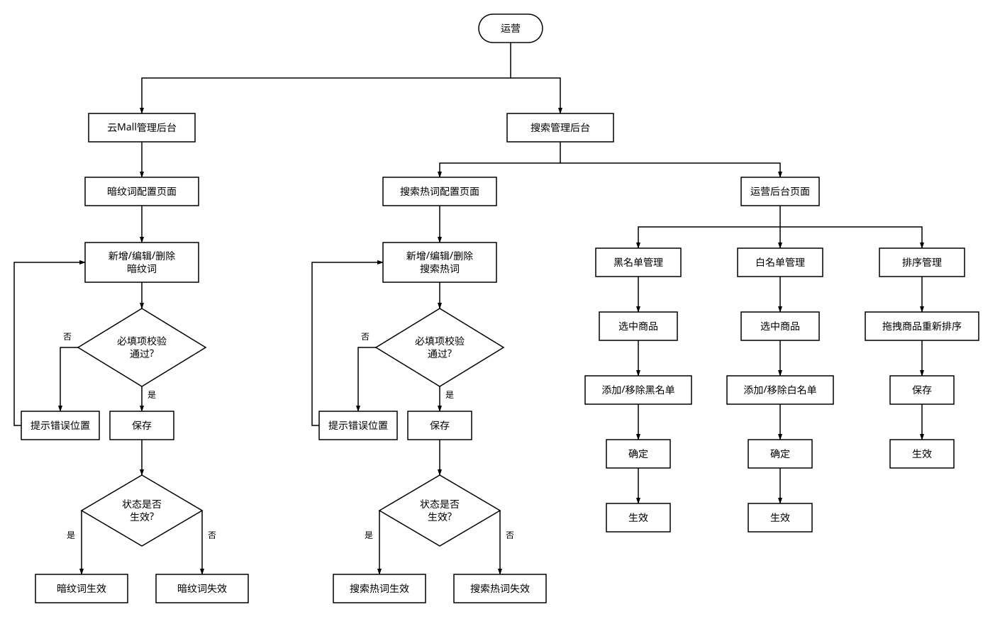

## 1.7 搜索域

### 系统交互图

### 外部协同

| 外部系统 | 交互内容 | 说明 |
| --- | --- | --- |
| 搜索系统 | 上线前云Mall向搜索系统同步全量数据； 后续商品相关数据有变动，云Mall向搜索系统增量同步 云Mall从搜索系统拉取搜索结果数据 |  |
| OMS系统 | 上线前OMS系统向云Mall系统同步全量数据； 后续商品相关数据有变动，OMS系统向云Mall系统增量同步 |  |
| Osmos系统 | 搜索系统从Osmos系统拉取广告商品数据 | 运营人员会在Osmos系统配置商品广告策略 |
| 推荐系统 | 搜索结果为空的场景下，云Mall从推荐系统拉取推荐数据 |  |

### 运营视角流程

### C端视角流程

### 场景示例

**文本搜索 + 联想词**：用户输入"牛" → 实时展示联想词（"牛奶"、"牛肉"、"牛油果"等）→ 用户点击联想词→ 搜索结果页→ 点击商品，进入商品详情

**扫码搜索**：1.用户点击扫码图标 → 进入到扫码页面 → 扫商品条形码 → 直接跳转商品详情页

2.用户点击搜索框中扫码图标 → 进入到扫码页面 → 扫码活动页二维码 → 直接跳转到活动页

**图像搜索**：用户点击扫码图标 → 切换到拍照页面 → 对商品进行拍照 → 跳转到图像搜索结果页

**广告置顶**：用户“搜索”可乐 → 搜索系统去Osmos系统查询“可乐”关联的广告商品 → 搜索系统将广告商品按照投放规则插入到可乐的搜索结果中 → 返回到用户 → 搜索结果页中展现广告商品

## 1.13 推荐域

### 系统交互图

### 外部协同

| 外部系统 | 交互内容 | 说明 |
| --- | --- | --- |
| 腾讯智能推荐系统 | 云Mall系统向腾讯智能推荐系统同步商品主数据； 云Mall 上报用户行为数据至腾讯智能推荐系统； 云Mall从腾讯智能推荐系统获取推荐数据 | 以下6个页面接入推荐数据： 1.首页商品瀑布流； 2.活动页商品瀑布流； 3.商品详情页面； 4.购物车页面； 5.结算页面； 6.支付成功页； |
| Osmos | 云Mall从Osmos中拉取广告数据； 云Mall上报用户行为数据到Osmos系统 |  |
| OMS | OMS系统向云Mall系统同步商品主数据 |  |

### 运营视角流程

### C端视角流程

### 场景示例

**首页****商品瀑布流****推荐位**：用户打开APP进入首页 → 用户看到首页商品瀑布流 → 商品瀑布流展示个性化推荐商品数据

**商品详情页推荐**：用户点击商品 → 进入到商品详情页 → 用户在商品详情页看到个性化推荐商品数据

**购物车、****结算页****、支付完成页推荐**：用户将商品添加到购物车 → 用户进入到购物车页面 → 用户看到购物车页面个性化推荐数据 → 用户点击结算 → 用户进入到结算页 → 用户看到结算页个性化推荐数据 → 用户进行支付 → 支付成功页面 → 用户看到支付页面个性化推荐数据
